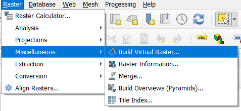
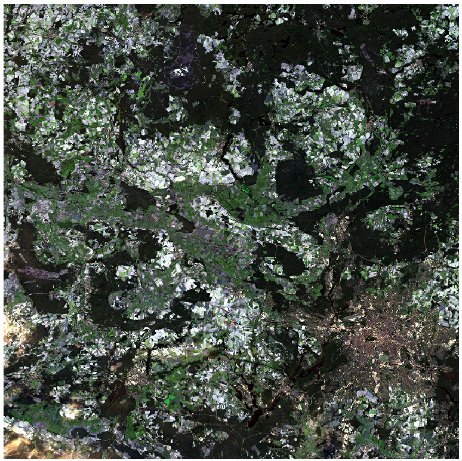
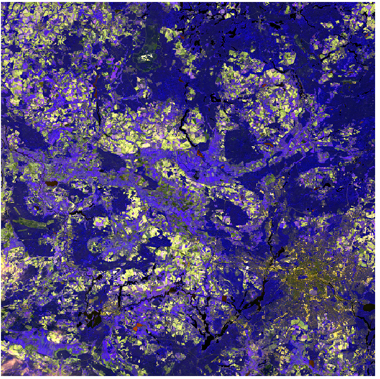
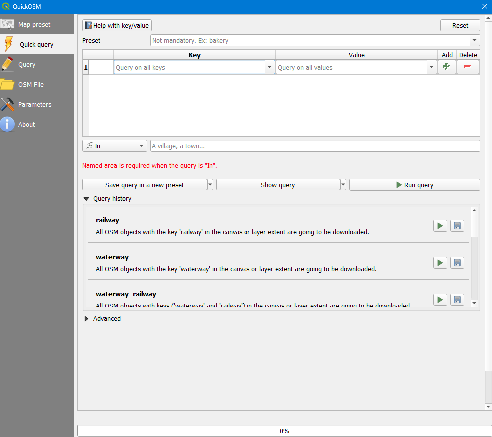
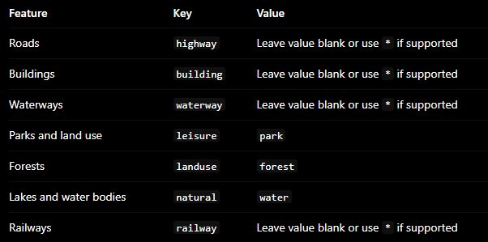
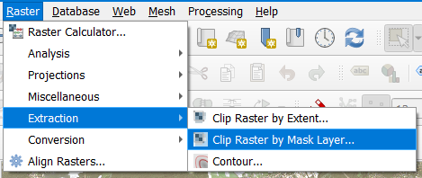
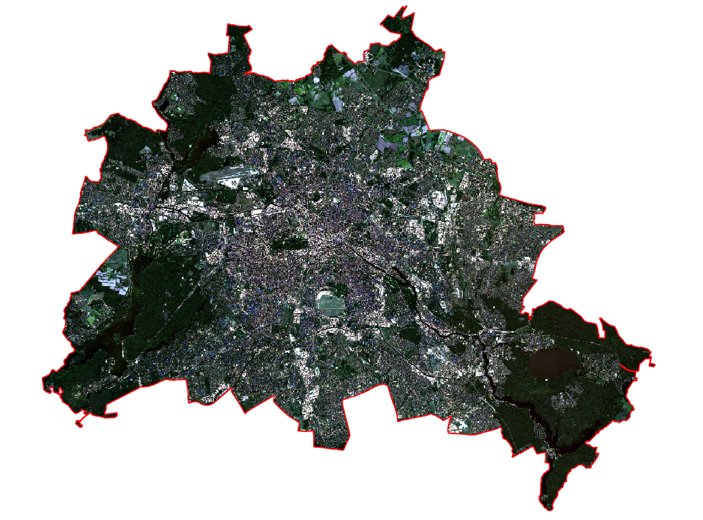

# Exercise Scenario

You are a remote-sensing researcher preparing a scientific map of a geographic area of your choice. You must combine a Sentinel-2 satellite image with vector datasets to communicate the area's physical and human geography.

You are responsible for selecting the satellite scene, obtaining appropriate vector data, choosing the coordinate reference system, creating the map symbology and designing the final layout.

Your map must be your own creation. You may use existing geographic datasets, but you must make and justify your own cartographic decisions.

## Learning objectives

By the end of the exercise, you should be able to:

- Download Sentinel-2 Level-2A imagery.

- Find and download relevant vector data from open-data sources.

- Create a study area and prepare spatial layers.

- Combine raster and vector datasets in QGIS.

- Use an appropriate CRS and clip data to the study area.

- Design a true-colour satellite composite.

- Apply meaningful vector symbology and labels.

- Create a scientific map layout with appropriate supporting information.

- Export and document a reproducible GIS project.

---

# 1. Download Satellite Imagery

- Download Sentinel-2 Imagery for Berlin using [Copernicus Browser](https://browser.dataspace.copernicus.eu/?zoom=9&lat=52.73297&lng=12.84302&themeId=DEFAULT-THEME&visualizationUrl=U2FsdGVkX1%2BBaB1uxG%2BTxSq0PdWrOD0lbtSeQevkMMoYZutahlth6rUx0i%2FPPwOpjqID9QXdKGi1GZ0lMzsLaVIKwJkhd7Hbc58xdlNSGRdMIyqWlI8%2B%2FDaLKgx%2Fq5%2Fe&datasetId=S2_L2A_CDAS&fromTime=2026-09-27T00%3A00%3A00.000Z&toTime=2026-09-27T23%3A59%3A59.999Z&layerId=1_TRUE_COLOR) (You may have to register at Copernicus Database to download Sentinel-2 imagery)

- Generally **MSI Level-2A** data is used.

- Chose a suitable acquisition date, with least possible amount of cloud cover. 

- Download the product of the required bands. 
(For this exercise we will be using True color and False color composite)

---

# 2. Create Satellite Composite

## True Color Composite

We use three bands for creating True color composite for Sentinel-2:

- Red Channel: **B04**
- Green Channel: **B03**
- Blue Channel: **B02**.

## False Color Composite 

- Red Channel: **B08** 
- Green Channel: **B04**
- Blue Channel: **B03**

In QGIS this is done by using the **Build Virtual Raster (VRT)** tool. 

Input the three bands for True color composite and run the tool. 

Repeat the same process for False color composite.

Now we should have image for Berlin, in both True color as well as False color composite.

**Note:** You may have to use 2 images to cover the whole area of Berlin. This can be done using the **Merge** tool. 

--- 

# 3. Download Vector Data

- For this step we use **QuickOSM** plug-in, this can be downloaded from,

- **Plugins -> Manage and Install Plugins -> QuickOSM**

- Open **Vector -> QuickOSM**

- We can use the Quick query to download vector data of our choice, below is an example of what kind of Vector data can be downloaded and mapped.

- QuickOSM can also be used to download the Administrative boundary of Berlin.

---

# 4. Clip Satellite Image to Study Area

The Sentinel-2 image is then clipped to the Berlin administrative boundary, using the following steps.

- Raster -> Extraction -> Clip Raster by Mask Layer

- Select the Sentinel-2 true color composite as input raster.

- Select administrative boundary as the mask layer.

The results should be a Sentinel-2 Scene with a boundary for Berlin.

--- 

# Tasks

- Select an area of your choice and generate a similar map.

- Select a suitable Vector data or generate your own to be portrayed on the map.

- Create your own cartographic design for vector data.

- Generate a map.
**Hint:** The map should contain all essential map elements such as;

Title, Legend, Scale Bar, North Arrow , Co-ordinate Grid, Locator Map, Author, Projection

- Export the map as PDF, and attach a small report with respect to the vector data portrayed on the map. i.e For Roads: Road density and land cover analysis.
